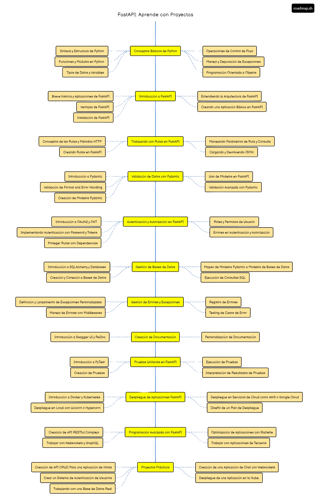

# FastAPI Learning Roadmap  

Este repositorio contiene mi progreso mientras sigo un roadmap para aprender **FastAPI** de forma práctica y estructurada.  

  

## Roadmap General  
El roadmap incluye los siguientes temas:  
1. Conceptos básicos de Python.  
2. Introducción a FastAPI.  
3. Trabajando con rutas en FastAPI.  
4. Validación de datos con Pydantic.  
5. Autenticación y autorización.  
6. Gestión de bases de datos.  
7. Gestión de errores y excepciones.  
8. Creación de documentación.  
9. Pruebas unitarias.  
10. Despliegue de aplicaciones FastAPI.  
11. Programación avanzada con FastAPI.  


## Estructura del Repositorio  
- **`docs/`**: Documentación adicional, como diagramas e imágenes.  
- **`src/`**: Código dividido en carpetas por cada tema del roadmap.  
- **`tests/`**: Pruebas unitarias e integrales.  

## Cómo ejecutar los ejemplos  
1. Clona este repositorio:  
   ```bash
   git clone https://github.com/tu-usuario/fastapi-learning-roadmap.git
   ```
2. Instala las dependencias:

    ```bash
    pip install -r requirements.txt
    ```

3. Ejecuta un servidor de desarrollo con Uvicorn:

    ```bash
    uvicorn src.part2-intro-fastapi.main:app --reload
    ```